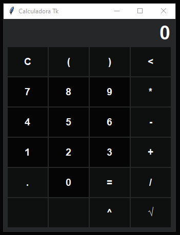

<div align='center'>
    <h1>Calculadora Tk</h1>
    
</div>

## Motivation
The project aims to encourage beginners in python programming to contribute to open source projects that go beyond Terminal, so that development is more visual.

Therefore, the Tk Calculator was created with basic mathematical features and with some intentional errors so that corrections and expansions of new features are made by the target audience (Beginners).

## to contribute
Siga os passos abaixo:

Follow the steps below:

Make the one from the Calculator TkFork project in the upper right corner of the screen;
Clone the project from your repository on github ( git clone https://github.com/SEU_USUARIO/calculadora-tk.git);
Create your branch to carry out your modification ( git checkout -b feature/nome_da_modificação);
After making your changes, make a commit( git commit -m "Descrição da modificação");
Do the Pushfor your repository ( git push origin feature/nome_modificação);
In your repository on Github create one Pull Requestso that your changes are evaluated to be done mergein the main project.

## Start
```
$ python main.py
```

or create your own file with the following script, and then follow the procedure above with the corresponding name:
```Python
# -*- coding: utf-8 -*-

# Builtin
import tkinter as tk

# Internal module
from app.calculadora import Calculadora

if __name__ == '__main__':
    master = tk.Tk()
    main = Calculadora(master)
    main.start()
```

## Guides
- Tkinter: Tkinter: Documentation - *There are several other guides on display at the top of the page*
- Git e Github: [Tutorial no Tableless](https://tableless.com.br/tudo-que-voce-queria-saber-sobre-git-e-github-mas-tinha-vergonha-de-perguntar/) - *Reading*
- Git e Github: [Tutorial no Youtube](https://www.youtube.com/playlist?list=PLQCmSnNFVYnRdgxOC_ufH58NxlmM6VYd1) - *Video Class*
- Pull Request no GitHub: [Tutorial DigitalOcean](https://www.digitalocean.com/community/tutorials/como-criar-um-pull-request-no-github-pt) - *Reading*
